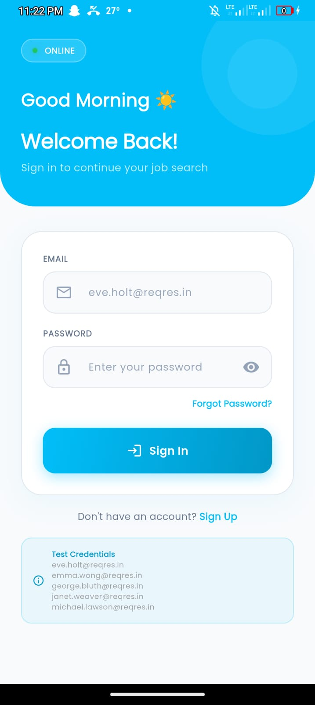
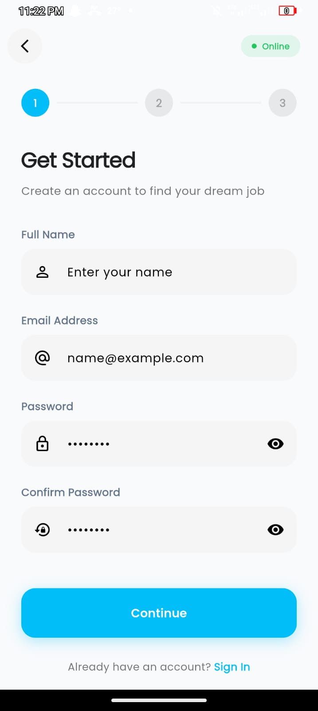
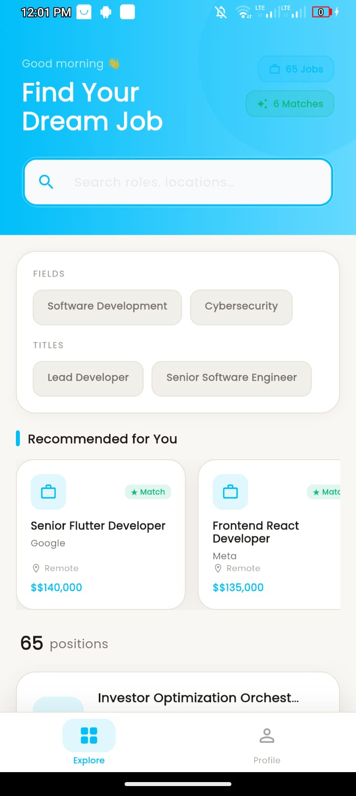
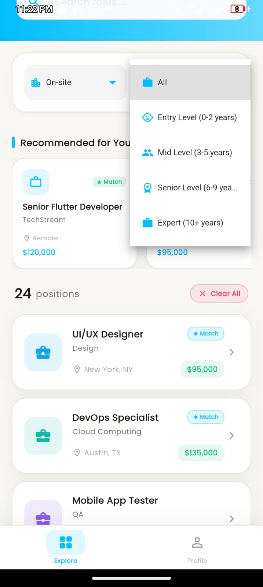
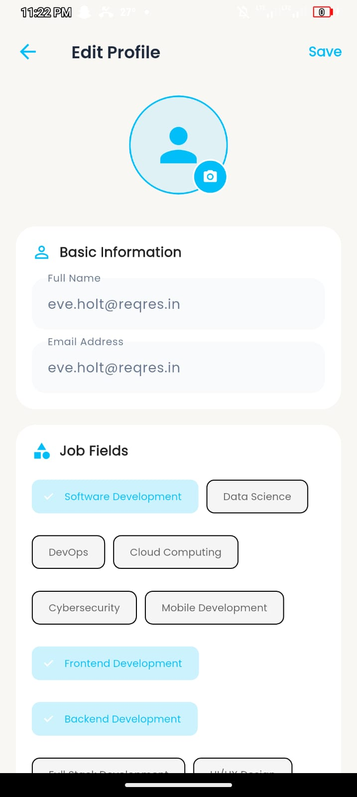

# 🚀 Job Finder - Your Dream Job Search Companion

A modern, feature-rich mobile application that helps job seekers find their perfect career opportunity. Built with Flutter, this app provides seamless job search experience with offline support and real-time updates.

## 📱 Screenshots

<div align="center">
  <table>
    <tr>
      <td align="center">
        
        <br/>
        <b>Sign In Screen</b>
      </td>
      <td align="center">
        
        <br/>
        <b>Sign Up Screen</b>
      </td>
      <td align="center">
        
        <br/>
        <b>Home Screen</b>
      </td>
    </tr>
    <tr>
      <td align="center">
        
        <br/>
        <b>Job Filters</b>
      </td>
      <td align="center">
        
        <br/>
        <b>Profile Screen</b>
      </td>
      <td align="center">
        <br/>
        <b>Job Details</b>
      </td>
    </tr>
  </table>
</div>

## ✨ Features

### 🔐 Authentication
- **Online Mode**: Register/Login using ReqRes.in mock API
- **Offline Mode**: Local authentication using SQLite database
- **Session Management**: Persistent login with SharedPreferences
- **Logout Functionality**: Secure logout with confirmation dialog

### 👤 User Profile
- **3-Step Registration**: Basic info → Job Preferences → Salary & Work Mode
- **Editable Profile**: Update personal info and job preferences
- **Job Preferences**: Select multiple job fields and titles
- **Salary Expectation**: Slider-based salary selection
- **Work Mode Preference**: Remote, Hybrid, or On-site

### 💼 Job Management
- **Browse Jobs**: View all available job listings
- **Search Jobs**: Search by title, company, or location
- **Advanced Filters**:
  - Job Fields Filter
  - Job Titles Filter
  - Work Mode Filter (Remote/Hybrid/On-site)
  - Experience Level Filter
- **Job Details**: View complete job information
- **Apply for Jobs**: Submit applications with form
- **CV Upload**: Attach resume (PDF/DOC/DOCX)

### 🌓 Theme Support
- **Light Mode**: Clean bright interface
- **Dark Mode**: Eye-friendly dark theme
- **Theme Persistence**: User preference saved

### 📶 Offline Support
- **SQLite Database**: Local storage for jobs and user data
- **Offline Authentication**: Login without internet connection
- **Smart Sync**: Syncs data when back online

## 📁 Complete Project Structure
job_finder/
│
├── android/ # Android-specific files
├── ios/ # iOS-specific files
├── assets/ # Static assets
│ ├── animations/
│ │ └── search.json # Lottie animation
│ └── screenshots/ # App screenshots
│
├── lib/
│ ├── main.dart # App entry point
│ │
│ ├── core/ # Core utilities
│ │ ├── constants/
│ │ │ ├── app_colors.dart # Color scheme
│ │ │ └── app_constants.dart # App constants
│ │ ├── themes/
│ │ │ └── app_theme.dart # Light/Dark themes
│ │ └── utils/
│ │ ├── validators.dart # Form validators
│ │ └── helpers.dart # Helper functions
│ │
│ ├── data/ # Data layer
│ │ ├── local/
│ │ │ └── database_helper.dart # SQLite operations
│ │ ├── models/
│ │ │ ├── user_model.dart
│ │ │ ├── job_model.dart
│ │ │ └── user_preferences_model.dart
│ │ └── remote/
│ │ ├── api_service.dart # Auth API calls
│ │ └── job_api_service.dart # Jobs API calls
│ │
│ ├── domain/ # Domain layer
│ │ └── entities/
│ │ ├── user.dart
│ │ ├── job.dart
│ │ └── user_preferences.dart
│ │
│ └── presentation/ # UI layer
│ ├── providers/
│ │ ├── auth_provider.dart # Auth state management
│ │ └── theme_provider.dart # Theme state management
│ │
│ ├── screens/
│ │ ├── splash_screen.dart
│ │ ├── signin_screen.dart
│ │ ├── signup_step1_screen.dart
│ │ ├── signup_step2_screen.dart
│ │ ├── signup_step3_screen.dart
│ │ ├── home_screen.dart
│ │ ├── profile_screen.dart
│ │ ├── edit_profile_screen.dart
│ │ └── apply_job_screen.dart
│ │
│ └── widgets/
│ ├── common/
│ │ ├── custom_button.dart
│ │ ├── loading_widget.dart
│ │ └── error_widget.dart
│ └── home/
│ ├── home_header.dart
│ ├── home_filters.dart
│ ├── home_suggestions.dart
│ ├── home_job_card.dart
│ └── home_job_details_sheet.dart
│
├── pubspec.yaml # Dependencies
└── README.md # Documentation


## 🛠️ Tech Stack

| Category | Technology |
|----------|------------|
| **Framework** | Flutter 3.x |
| **Language** | Dart 3.x |
| **State Management** | Provider |
| **Local Database** | SQLite (sqflite) |
| **Local Storage** | SharedPreferences |
| **Networking** | HTTP Package |
| **Animations** | Lottie |
| **Authentication API** | ReqRes.in |
| **Jobs API** | MockAPI.io |

## 📦 Dependencies

```yaml
dependencies:
  flutter:
    sdk: flutter
  
  # UI Components
  google_fonts: ^6.1.0
  lottie: ^2.7.0
  
  # Database & Storage
  sqflite: ^2.3.0
  shared_preferences: ^2.2.2
  path: ^1.8.3
  
  # Networking
  http: ^1.1.0
  
  # State Management
  provider: ^6.1.1
  
  # File Handling
  file_picker: ^6.1.1
  🚀 Installation Guide
Prerequisites
Flutter SDK (>=3.0.0)

Dart (>=3.0.0)

Android Studio / VS Code

Android Emulator / iOS Simulator

Step 1: Clone Repository
bash
git clone https://github.com/yourusername/job-finder.git
cd job-finder
Step 2: Install Dependencies
bash
flutter pub get
Step 3: Run the App
bash
flutter run
Step 4: Build APK (Android)
bash
flutter build apk --release
🔐 Online Sign Up - Email Requirements
When signing up in ONLINE MODE, you must use one of these valid test emails:

✅ Valid Test Emails for Online Registration:
Email	Works
eve.holt@reqres.in	✅ Yes
emma.wong@reqres.in	✅ Yes
george.bluth@reqres.in	✅ Yes
janet.weaver@reqres.in	✅ Yes
michael.lawson@reqres.in	✅ Yes
lindsay.ferguson@reqres.in	✅ Yes
tobias.funke@reqres.in	✅ Yes
byron.fields@reqres.in	✅ Yes
george.edwards@reqres.in	✅ Yes
rachel.howell@reqres.in	✅ Yes
🔑 Online Login Credentials:
text
Email: eve.holt@reqres.in
Password: cityslicka
📝 Offline Mode:
ANY email works (e.g., your@email.com)

Password: Any (min 6 characters)

Must register first while online to use offline mode

🔌 API Endpoints
Authentication (ReqRes.in)
text
POST   https://reqres.in/api/register
POST   https://reqres.in/api/login
GET    https://reqres.in/api/users
Jobs (MockAPI.io)
text
GET    https://6a02decc0d92f63dd2545858.mockapi.io/jobs
POST   https://6a02decc0d92f63dd2545858.mockapi.io/jobs
PUT    https://6a02decc0d92f63dd2545858.mockapi.io/jobs/{id}
DELETE https://6a02decc0d92f63dd2545858.mockapi.io/jobs/{id}
📱 App Flow
text
┌─────────────────────────────────────────────────────────────┐
│                      SPLASH SCREEN                          │
│                     (3 seconds delay)                       │
└─────────────────────────────────────────────────────────────┘
                              ↓
              ┌───────────────────────────────┐
              │   Check Authentication Status  │
              └───────────────────────────────┘
                     ↓                    ↓
                 LOGGED IN            NOT LOGGED IN
                     ↓                    ↓
              ┌─────────────┐      ┌─────────────┐
              │  HOME PAGE  │      │ SIGN IN     │
              └─────────────┘      └─────────────┘
                                         ↓
                              ┌─────────────────────┐
                              │    SIGN UP STEP 1    │
                              │    (Basic Info)      │
                              └─────────────────────┘
                                         ↓
                              ┌─────────────────────┐
                              │    SIGN UP STEP 2    │
                              │  (Job Preferences)   │
                              └─────────────────────┘
                                         ↓
                              ┌─────────────────────┐
                              │    SIGN UP STEP 3    │
                              │   (Salary & Mode)    │
                              └─────────────────────┘
                                         ↓
                              ┌─────────────────────┐
                              │      HOME PAGE       │
                              └─────────────────────┘
🎨 UI Features
Clean Modern Design: Professional color scheme (#01BEF9)

Responsive Layout: Works on all screen sizes

Smooth Animations: Lottie animations and transitions

Time-based Greetings: Morning/Afternoon/Evening messages

Pull to Refresh: Update job listings

Loading States: Visual feedback for async operations

Error Handling: User-friendly error messages

📝 Features Checklist
User Registration (3-step)

User Login (Online/Offline)

Job Listing with Search

Advanced Filters (Fields, Titles, Work Mode, Experience)

Job Details View

Apply for Jobs with Form

Profile Management

Edit Profile

Edit Job Preferences

Dark/Light Mode

Offline Support

Logout Functionality

Delete Account

🤝 Contributing
Fork the repository

Create feature branch (git checkout -b feature/amazing)

Commit changes (git commit -m 'Add feature')

Push to branch (git push origin feature/amazing)

Open Pull Request

📄 License
This project is created for educational purposes as part of mobile development assignment.

👨‍💻 Developer
Your Name

GitHub: @yourusername

Email: your.email@example.com

🙏 Acknowledgments
ReqRes.in - Mock authentication API

MockAPI.io - Jobs API

Flutter Team - Amazing framework

Google Fonts - Typography

<div align="center"> <p>Made with ❤️ using Flutter</p> <p>© 2024 Job Finder App</p> </div> ```